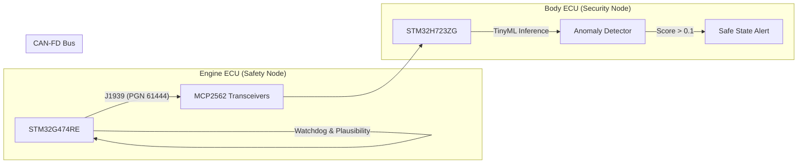

# ecu-edge-ai-can-anomaly
# Automotive Safety & Security ECU Prototype
**ISO 26262 Functional Safety | TinyML Intrusion Detection | Zephyr RTOS**

## Executive Summary
This project demonstrates a production-grade automotive architecture integrating **Functional Safety (ASIL-B)** and **Cybersecurity (Edge AI)**.

The system consists of a distributed architecture with two ECUs communicating over **CAN-FD** using the **SAE J1939** protocol. It features a "Safety Node" (Engine ECU) that enforces real-time plausibility checks and a "Security Node" (Body ECU) that utilizes an on-device **Autoencoder Neural Network** to detect CAN bus anomalies in under 2ms.

## System Architecture

## Key Features
| Domain | Feature | Implementation Details |
| :--- | :--- | :--- |
| Functional Safety | Fault Detection | Implemented Watchdog Timer (WDT) and Data Plausability Check (Range/Gradient) to meet ASIL-B goals. |
| Networking | J1939 & UDS | Custom J1939 PGN construction and UDS Service 0x10 (Diagnostic Session Control) implementation. |
| AI/Security | TinyML IDS | Custom C-based Inference Engine running an Autoencode (76 parameters) to detect malicious CAN injection. |
| Lifecycle | Secure Boot | Implemented MCUboot chain-of-trust with RSA-2048 signed firmware and A/B patition OTA swapping |
| Architecture | Edge Computing | Designed edge-first architecture to process anomalies locally,reducing cloud bandwith dependencies |

## Hardware & Software Stack
 . Microcontrollers: STM32G474RE (Engine), STM32H723ZG (Body)
 . RTOS: Zephyr RTOS (v3.7+)
 . Transceivers: Microchip MCP2562FD
 . Languages: C (Firmware), Python (ML Training)
 . Tools: West, CMake, Keras/TensorFlow, Imgtool, Ztest, Github Actions

 ## Repository Structure
      ├── firmware/
      │   ├── ecu_engine/       # Project A: Safety-critical Engine Node
      │   ├── ecu_body/         # Project A: Body Control Node
      │   └── ids_node/         # Project B: AI Security Node (with MCUboot)
      ├── ml/                   # Python scripts for Autoencoder training
      ├── ota/                  # RSA Keys and Signing Scripts
      ├── docs/                 # Engineering Artifacts (HARA, FMEA, Verification Reports)
      ├── tests/                # Unit Tests (Ztest) for AI logic
      └── .github/workflows/    # CI/CD Pipeline configuration

## Verification & Results
  This Project focuses on verification-driven development. Key artifacts include:
    1. Safety Analysis : 
        . HARA (Hazard Analysis): Identified top-level hazards (e.g., Unintended Acceleration).
